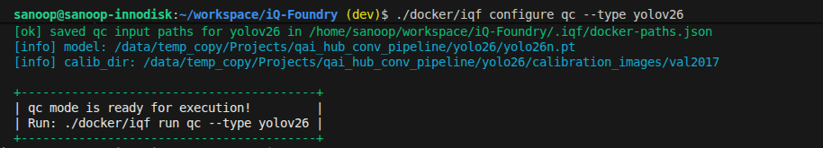
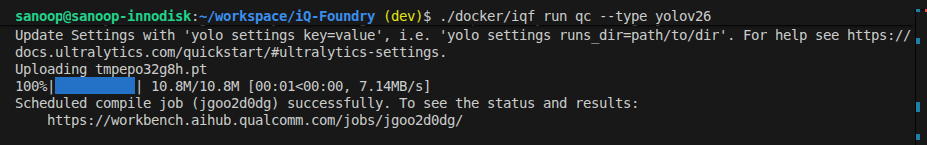

# Model Deploy: How to Convert, Optimize, and Perform Inference with YOLO26 Models ?

This iQ-Studio tutorial follows the [iQ-Foundry](https://github.com/InnoIPA/iQ-Foundry) YOLO26 workflow for EXMP-Q911 (Qualcomm QCS9075). It covers the default Ubuntu host flow for model preparation, quality assurance, and ADB-based inference through `./docker/iqf`.


## Overview

This guide follows a straightforward end-to-end flow:

1. Quantize and convert the FP32 YOLO model into a deployment-ready `.tflite` model with Qualcomm AI Hub.
2. Compare source and converted model quality with mAP.
3. Run inference on EXMP-Q911 (Qualcomm QCS9075) through ADB from the Ubuntu host.

If you need pretrained YOLO weights (.pt), download the official models from [Ultralytics](https://docs.ultralytics.com/).

## Requirements

| Item | Requirement |
| --- | --- |
| Host OS | x86 Ubuntu 22.04 |
| Target | EXMP-Q911 (Qualcomm QCS9075) |
| Connection | USB-C for ADB-based execution |
| QAI Hub | [Qualcomm AI Hub](https://aihub.qualcomm.com/) API token |

> **Note:** This tutorial follows the Ubuntu host workflow. If you are using Windows, refer to the
> [iQ-Foundry Windows Host Guide](https://github.com/InnoIPA/iQ-Foundry/blob/main/Windows_host.md).

## Step 1. Connect Device

Connect the EXMP-Q911 target to the host with a USB-C cable.


adb reference: [adb overview](https://developer.android.com/tools/adb). No steps are required from that page for this tutorial.

For more about ADB interaction, see [Interact with the system using adb](../../../starting-guides/q911/README.md#interact-with-the-system-using-adb-over-usb-type-c).

## Step 2. Clone the Repository and Prepare the Host

Clone the iQ-Foundry repository, go to the repository directory, install Docker Engine, and pull the published iQF image:

```bash
git clone https://github.com/InnoIPA/iQ-Foundry.git
cd iQ-Foundry
bash ./docker_install.sh
docker pull innodiskorg/iqf:latest
```

Docker Engine and the published `innodiskorg/iqf:latest` image provide the prepared runtime used by `./docker/iqf` on the Ubuntu host.

## Step 3. Authenticate with Qualcomm AI Hub

Log in to the [Qualcomm AI Hub Workbench](https://aihub.qualcomm.com/).

Navigate to `Account -> Settings -> API Token` to find your unique key.

Authenticate the host workflow with your API token:

```bash
./qaihub_login.sh --key <YOUR_QAI_HUB_API_KEY>
```

This stores the host-side QAI Hub configuration used by the Docker wrapper workflow.

## Step 4. Run the Modes

> Note: The `--type` option supports `yolov10`, `yolov11`, and `yolov26`.

Follow the steps for each mode below to convert the model (qc), evaluate its quality (mAP), and deploy YOLO inference (test).

### 1. QC

`qc` quantizes and compiles the YOLO model from `.pt` into a deployment-ready `.tflite` artifact.

Configure the required paths:

```bash
./docker/iqf configure qc --type yolov26
```

When prompted, enter the requested model and calibration paths.



Run the mode:

```bash
./docker/iqf run qc --type yolov26
```

This generates the converted YOLO `.tflite` model in the output directory.



Output location: `out/model/yolov26/`

### 2. mAP

`mAP` compares the FP model and the converted model at mAP@0.5.

Configure the required paths:

```bash
./docker/iqf configure mAP --type yolov26
```

When prompted, enter the requested annotation, image, FP model, and converted model paths.

Run the mode:

```bash
./docker/iqf run mAP --type yolov26
```

For a smaller validation run, you can limit the number of images:

```bash
./docker/iqf run mAP --type yolov26 --max-images 5
```

This produces the source-versus-converted quality comparison report.


Output location: `out/mAP_results/yolov26/`

### 3. Test

`test` runs ADB-based YOLO inference on EXMP-Q911 (Qualcomm QCS9075) and saves the output artifacts.

Configure the required paths:

```bash
./docker/iqf configure test --type yolov26
```

When prompted, enter the requested model, YAML, and test image paths.

Run the mode:

```bash
./docker/iqf run test --type yolov26 --adb
```

This runs inference on the target and saves the generated result artifacts.


<p align="center">
  
</p>

This inference example was generated using a pretrained [Ultralytics YOLO26 model](https://docs.ultralytics.com/models/yolo26/).

Output location: `out/test/yolov26/`

> 💡 Tip: To review the currently saved mode paths, open `.iqf/docker-paths.json`.

## Additional Options

For the broader Ubuntu host workflow, see the [iQ-Foundry Ubuntu Host Guide](https://github.com/InnoIPA/iQ-Foundry/blob/main/Ubuntu_host.md).

For advanced mode-specific flags and usage, see:

- [iQ-Foundry QC Mode Guide](https://github.com/InnoIPA/iQ-Foundry/blob/main/docs/qc_mode.md)
- [iQ-Foundry mAP Mode Guide](https://github.com/InnoIPA/iQ-Foundry/blob/main/docs/mAP_mode.md)
- [iQ-Foundry Test Mode Guide](https://github.com/InnoIPA/iQ-Foundry/blob/main/docs/test_mode.md)

Currently supported YOLO variants in iQ-Foundry include YOLO10, YOLO11, and YOLO26.
