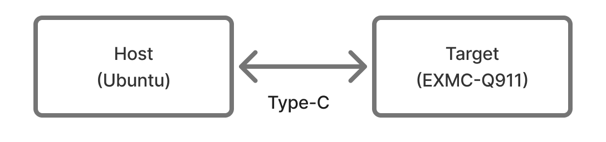

# Q911 Image Flashing Guide

This guide provides instructions for flashing or updating the system image on the Q911 platforms, including EXEC-Q911 and APEX-A100.

If you need a new flash package, please contact us first. We mainly provide Yocto Linux images. If you want to run Ubuntu and make sure all IO functions work correctly, please contact us to obtain a validated image.

The steps below ensure that your flashing process completes successfully, as the hardware must be switched to the correct mode before flashing.


## Host and Target Setup

When you need to update the BSP or recover a corrupted system, please first check the prerequisites in [Qualcomm’s instructions for flashing software](https://docs.qualcomm.com/doc/80-90441-252/topic/Integrate-and-flash-software.html?product=1601111740076074&facet=Ubuntu%20quickstart#prerequisites). We usually use Ubuntu as the host system, so please make sure the host environment is ready before you start.

For the initial setup on an Ubuntu host, please follow Steps 1-2 in [Flash Dragonwing IQ-9075 EVK Integrated Image on an Ubuntu Host](https://docs.qualcomm.com/doc/80-90441-252/topic/Integrate-and-flash-software.html?product=1601111740076074&facet=Ubuntu%20quickstart#panel-0-0-0tab$flash-dragonwing-iq-9075-evk-integrated-image-on-ubuntu-host).

<div align="center">
  
</div>

## Step 1: Prepare the Board for Flashing

Set the jumper on the bottom side of the board to `EDL mode`.

  <p align="center">
    
  </p>

Please also confirm that all boot mode DIP switches are set to `ON`, as shown below, so the system can boot from `UFS`.

  <p align="center">
    
  </p>

## Step 2: Connect the Target

Connect the USB Type-C cable to the port labeled `Flash / ADB` on the target device.

  <div align="center">
    <table>
      <tr>
        <td align="center"  width="50%" valign="bottom">
          
        </td>
        <td align="center"  width="50%" valign="bottom">
          
        </td>
      </tr>
      <tr>
        <td align="center">EXEC-Q911</td>
        <td align="center">APEX-A100</td>
      </tr>
    </table>
  </div>

## Step 3: Power On

After the board is set to `EDL mode` and all boot mode DIP switches are confirmed to be `ON`, connect the power supply and press the power button.


  <div align="center">
    <table>
      <tr>
        <td align="center"  width="50%" valign="bottom">
          
        </td>
        <td align="center"  width="50%" valign="bottom">
          
        </td>
      </tr>
      <tr>
        <td align="center">EXEC-Q911</td>
        <td align="center">APEX-A100</td>
      </tr>
    </table>
  </div>


## Step 4: Flash the Image

1. After verifying all prerequisites, extract the image package provided by us on the host.

    ```bash
    unzip image.zip
    cd image
    ```

    You will see files similar to the list below. Only part of the tree is shown here.

    ```text
    .
    ├── aop.mbn
    ├── cpucp.elf
    ├── devcfg_iot.mbn
    ├── dtb.bin
    ├── el2-dtb.bin
    ├── gpt_backup0.bin
    ├── gpt_backup1.bin
    .
    .
    .
    ```
2. Use the exact flashing command from the official Qualcomm documentation. Follow Step 3 in [Flash Dragonwing IQ-9075 EVK Integrated Image on an Ubuntu Host](https://docs.qualcomm.com/doc/80-90441-252/topic/Integrate-and-flash-software.html?product=1601111740076074&facet=Ubuntu%20quickstart#panel-0-0-0tab$flash-dragonwing-iq-9075-evk-integrated-image-on-ubuntu-host).

If the flashing process completes successfully, you will see output similar to the following.
    <p align="center">
    
    </p>


## Step 5: Switch Back to Normal Boot Mode

After the flashing process is complete, power off the device and set the jumper on the bottom side of the board to `Normal mode`.

  <p align="center">
    
  </p>

Please also confirm that all boot mode DIP switches are set to `ON`, as shown below, so the system boots from `UFS`.

  <p align="center">
    
  </p>

## Step 6: Boot into the System

After the board is back in `Normal mode`, power on the device and boot into the system.

After the system boots, please refer to the [Q911 Quick Start Guide: Interact with the System](../q911/README.md#step-3-interact-with-the-system) for the supported interaction methods, including DisplayPort, SSH, ADB, and UART.

If you log in to Ubuntu and find that the network is not available, you can install the `iq-ubuntu.deb` package provided by us by following the steps below:

1. Use a USB storage device to copy the `iq-ubuntu.deb` file to the system. The package is included in the BSP image folder.
2. Install the package using `sudo apt install </path/to/iq-ubuntu.deb>`.
3. Reboot the system. Network functionality will be available after the restart.
