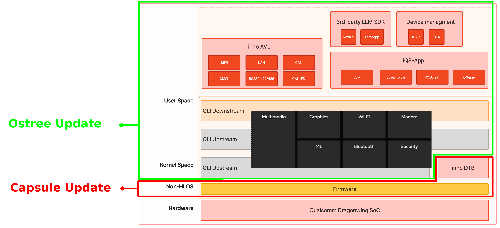
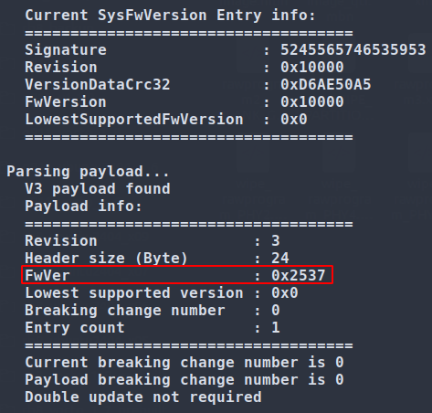
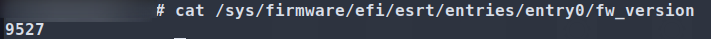

# Qualcomm OTA Guide

This guide provides instructions for updating firmware and operating systems on Qualcomm Linux platforms using Capsule and OSTree update methods.

## Core Software Stack & Architecture

The following diagram illustrates the software stack transition and the positioning of OTA updates within the system.

<div align="center">
  
</div>

- **Capsule Update**: Uses a UEFI capsule to update firmware on Qualcomm Linux devices. The capsule is downloaded to the EFI partition during normal operation and applied automatically on the next reboot.
- **OSTree Update**: Provides atomic, version-controlled Linux OS updates. Devices pull filesystem snapshots from a repository, allowing for safe rollbacks if an update fails.

## How to Use - Capsule Update

### 1. Prepare the .capsule file
Please refer to [Generate Capsule](https://github.com/quic/cbsp-boot-utilities/tree/main/uefi_capsule_generation) for detailed generation instructions.

> 🔔 **Note:** The `-fwver` option is used with `capsule_creator.py` to specify the firmware version number.

### 2. Update the .capsule file
Refer to the [Capsule update flow](https://docs.qualcomm.com/doc/80-70020-27/topic/ota_update_for_qualcomm_linux.html#capsule-update-flow) for the execution process.

### 3. Verify the Update

In **Step 1 (Prepare the .capsule)**, if the `-fwver` option is used to specify the version as `0.0.0.9527`, the update can then be verified through the following steps:

- **UART Boot Log**: The boot log will display the `FwVer` value as `9527 (0x2537)`.
  

- **System Command**: After booting into the system, run the following command to check the firmware version:
  ```bash
  $ cat /sys/firmware/efi/esrt/entries/entry0/fw_version
  ```
  The output should be `9527`.  
  

This confirms that the capsule has been successfully updated. For further details, refer to [Capsule update logs](https://docs.qualcomm.com/doc/80-70018-4/topic/capsule-update-logs.html) and [Capsule update flow](https://docs.qualcomm.com/doc/80-70020-27/topic/ota_update_for_qualcomm_linux.html#capsule-update-flow).

## How to Use - OSTree Update

### 1. Prepare & Update the OSTree
Refer to the [Linux OS update flow using OSTree](https://docs.qualcomm.com/doc/80-70020-27/topic/ota_update_for_qualcomm_linux.html#linux-os-update-flow-using-ostree) for step-by-step instructions.

### 2. Verify the Update
Step 6 of the [Linux OS update flow using OSTree](https://docs.qualcomm.com/doc/80-70020-27/topic/ota_update_for_qualcomm_linux.html#linux-os-update-flow-using-ostree) explains how to verify the update.

## Explore Documentation & Resources

- [OTA update for Qualcomm Linux](https://docs.qualcomm.com/doc/80-70020-27/topic/ota_update_for_qualcomm_linux.html)
- [IQS Development Guidelines](../../../IQS.md)
